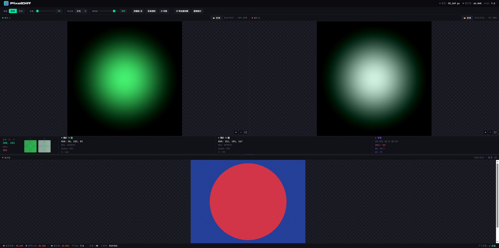

<div align="center">
 
# ⚡ PixelDiff
 
**A pixel-level image comparison tool for designers, engineers, and QA — runs entirely in your browser.**
 
[](LICENSE)
[](#)
[](#)
[](#)
 
<br/>
 

 
</div>
 
---
 
## What it does
 
PixelDiff loads two images side by side and computes a per-pixel difference map in real time. Differences are highlighted in your choice of color; matching pixels are shown in blue. Every pixel you hover over shows its full RGBA, hex, and BT.709 luminance (Y) value for both images — along with the per-channel deltas — in a persistent HUD at the bottom of the viewport.
 
It was built to replace the workflow of "open both images in Photoshop → subtract layers → squint". Everything runs in a single `pixeldiff.html` file with no server, no build step, and no data leaving your machine.
 
---
 
## Features
 
### Comparison Modes
- **Side-by-side** — A and B displayed in synchronized panes that pan together
- **Slider** — drag a divider across a single composited view to reveal A vs B
 
### Diff Engine
- Configurable **tolerance** (0–255) with real-time re-computation
- Difference highlight colors: Red · Cyan · Yellow · Magenta · **Heatmap**
- **Anti-aliasing ignore** — skips pixels whose neighbors exceed a contrast threshold
- **Gray same pixels** — desaturate matching areas to make diffs pop
- Matching pixels rendered in **solid blue** for immediate visual separation
 
### Pixel Inspector HUD
Hover anywhere on any image or the diff canvas to see:
 
| Field | Description |
|---|---|
| X, Y | Image-space pixel coordinate |
| RGB | Per-channel 0–255 values for A and B |
| HEX | Web hex color code |
| Alpha | Transparency channel |
| **Y** | BT.709 luminance `0.2126R + 0.7152G + 0.0722B` |
| ΔR ΔG ΔB | Per-channel absolute differences |
| ΔMax | Maximum channel delta |
| ΔE | Euclidean RGB color distance (0–100) |
| **ΔY** | Luminance difference |
 
Includes a **9×9 pixel magnifier** (with grid lines and center crosshair) for both A and B.
 
### Navigation
- **Ctrl + Scroll** to zoom — all three panels (A, B, diff) scale in sync
- **Drag to pan** — all panels scroll together; no panel falls behind
- Slider mode supports independent **zoom and pan** of the composited view
- ⊡ fit button resets to the default scale
 
### Stats Bar
After any diff: total diff pixels, diff %, similarity %, average ΔE, tolerance, resolution, and size-match status — all copyable to clipboard.
 
### Import / Export
- Load images via **📂 button** or **drag-and-drop** onto either panel
- Export the diff canvas as a PNG
- Copy all statistics as plain text
 
---
 
## Usage
 
```
# No install. Just open the file.
open pixeldiff.html
```
 
Or serve it statically:
 
```bash
npx serve .
# → http://localhost:3000/pixeldiff.html
```
 
1. Click **📂 打开 / Open** in the A panel header (or drag an image onto the panel)
2. Do the same for B
3. The diff renders automatically
4. Adjust **tolerance** with the slider or ↑ / ↓ arrow keys
5. Hover any image to inspect pixel values
 
---
 
## Roadmap
 
- [ ] **HSL / HSV readout** — hue, saturation, lightness alongside RGB in the inspector
- [ ] **Diff heatmap overlay on A/B** — optional semi-transparent heatmap directly on the source panels
- [ ] **Zoom anchor at cursor** — zoom toward the mouse position rather than the image center
- [ ] **Region selection** — draw a rectangle to restrict the diff computation to a subregion
- [ ] **Histogram panel** — per-channel histogram for A, B, and the diff
- [ ] **Batch compare** — drop a folder and step through image pairs with keyboard arrows
- [ ] **Session persistence** — remember last used tolerance, color, and view mode across reloads
- [ ] **URL-based sharing** — encode image URLs + settings into a shareable link
- [ ] **SSIM score** — Structural Similarity Index as an alternative perceptual metric
- [ ] **Animated diff** — flicker / blend animation between A and B at configurable speed
- [ ] **Dark/light theme toggle**
- [ ] **Keyboard shortcuts reference panel**
- [ ] **Localization** — English UI option (currently Simplified Chinese)
 
---
 
## Architecture
 
PixelDiff is a single self-contained HTML file (~1 100 lines) organized into labeled CSS and JS modules. No bundler, no framework.
 
```
css-variables      Design tokens
css-toolbar        Header + toolbar controls
css-layout         3-panel Beyond Compare–style layout
css-probe          Pixel inspector HUD
 
js-state           Global state object
js-diff            Pixel diff engine  ← core algorithm
js-render          Canvas drawing
js-stats           Stats bar updates
js-loader          File loading + drag-drop
js-slider          Slider compare (canvas-based)
js-splitter        Horizontal resize handle
js-utils           Zoom · pan sync · export · toast
js-probe           Pixel inspector + magnifier
js-app             Event wiring + mode switching
```
 
The diff engine (`js-diff`) runs synchronously on the main thread. For images larger than ~4 MP this can cause a brief UI stall; offloading to a Web Worker is on the roadmap.
 
---
 
## Contributing
 
Bug reports and PRs are welcome. The file is intentionally kept as a single HTML deliverable — please don't add a build system or external dependencies without discussion.
 
```bash
git clone https://github.com/your-handle/pixeldiff
cd pixeldiff
open pixeldiff.html   # that's it
```
 
---
 
## License
 
[GNU General Public License v3.0](LICENSE)
 
You are free to use, study, modify, and distribute this software under the terms of the GPLv3. Any derivative work must also be distributed under the same license and remain open source.
 
---
 
<div align="center">
<sub>Built with vanilla JS · zero dependencies · no telemetry · your images never leave your device</sub>
</div>